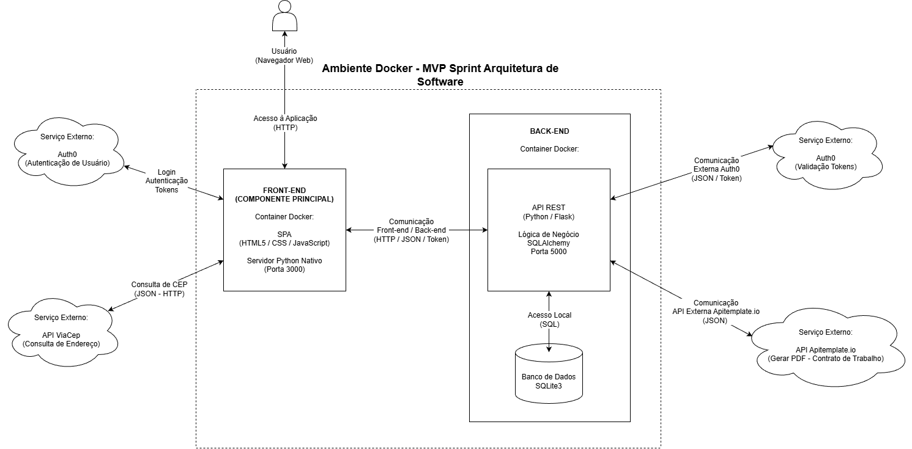

# Sistema de Gerenciamento de Funcionários - RH - Frontend

Esta é a interface de usuário para o Sistema de Gerenciamento de RH. É uma Single Page Application (SPA) construída com HTML, CSS e JavaScript, que consome dados de APIs (back-end, ViaCep, Auth0) para realizar todas as suas operações.

## Arquitetura da Solução

O diagrama abaixo ilustra como o Front-end interage com a API, o serviço de autenticação (Auth0) e as APIs externas.



## ✨ Funcionalidades

* Interface intuitiva para todas as operações de CRUD de funcionários e anotações.
* Busca de dados de funcionários e registros de acessos aos ônibus por múltiplos critérios.
* Visualização de dados (Tabelas com paginação, e dashboards com Cards e Gráficos).
* Geração e download de relatórios em formato Excel (.xlsx).
* Geração e download de PDFs com QR Codes para identificação através da matrícula.
* Geração e download de contrato de trabalho em PDF.

## 🚀 Tecnologias Utilizadas

* **HTML5**
* **CSS3**
* **JavaScript (ES6+)**
* **Auth0 SPA SDK**
* **SheetJS (js-xlsx)**

## ⚙️ Configuração

### Pré-requisitos

* Python 3.8 ou superior (para rodar o servidor local `http.server` ao executar a aplicação em ambiente virtual)
* `pip` (gerenciador de pacotes do Python)
* Um navegador web moderno (Chrome, Firefox, Edge, etc.).
* O **Backend (API) deve estar em execução** para que o frontend possa se comunicar com ele.

## 🚀 Executando o Front-end

⚠️ Importante: Recomenda-se a criação de um ambiente virtual antes de executar a aplicação. O passo a passo pode ser encontrado no arquivo READEME.md do back-end.

Para que o sistema de autenticação (Auth0) funcione corretamente, a aplicação **não pode** ser aberta diretamente pelo gerenciador de arquivos (o protocolo `file:///`). É necessário servir os arquivos através de um servidor web local.

Como o projeto já utiliza Python no back-end, recomenda-se utilizar o módulo `http.server` nativo do Python.

### Passo a Passo

#### ▶️ Como Executar a Aplicação Utilizando Ambiente Virtual
    
    1.  Abra o terminal na pasta do front-end (`hr_system_front`), ou navegue até ela (pelo terminal), após iniciar o ambiente virtual.
    2.  Execute o seguinte comando para iniciar o servidor na porta 3000:

        ```bash
        python -m http.server 3000
        ```

    3.  Abra o seu navegador e acesse exatamente este endereço:
        * 👉 **[http://127.0.0.1:3000/](http://127.0.0.1:3000/)**

    > **Nota:** Mantenha este terminal aberto enquanto estiver utilizando a aplicação.

#### 🐳 Como Executar a Aplicação Utilizando Orquestração Docker (Opção Mais Simples)

Se você tem o Docker instalado, pode subir os dois componentes (Front-end na porta 3000 e Back-end na porta 5000) com um único comando.
Se ainda não possui o Docker, instale a versão compatível com seu sistema operacional, disponível em: "https://www.docker.com/". Leia a documentação oficial para mais esclarecimentos.

1.  **Crie o arquivo `.env`** (na pasta `hr_system_api/`) e cole as chaves e credenciais dentro dele.
2.  **Navegue até a pasta do Front-end** (onde está o `docker-compose.yml`).
    ```bash
    cd ../hr_system_front
    ```
3.  **Execute a Aplicação:**
    Primeira vez, e quando fizer alterações:
    ```bash
    docker-compose up --build
    ```
    Demais vezes:
    ```bash
    docker-compose up
    ```
    (Este comando dispensa a criação manual do ambiente virtual e a execução separada do `flask run`).
    Após o início, a documentação Swagger estará disponível em: 👉 http://127.0.0.1:5000/openapi/swagger
    A interface do usuário poderá ser acessada em: * 👉 **[http://127.0.0.1:3000/](http://127.0.0.1:3000/)**

## ❗ Solução de Problemas Comuns

### Erro: "Callback URL mismatch" ou Tela de Login não carrega

Se você tentar abrir o arquivo `index.html` clicando duas vezes nele, a autenticação poderá falhar.

  * **Sintoma:** A URL no navegador começa com `file:///C:/...`
  * **Causa:** O Auth0 bloqueia execuções via arquivo por motivos de segurança. Ele exige o protocolo HTTP/HTTPS.
  * **Solução:** Feche a aba, inicie o servidor Python conforme as instruções acima e acesse via `http://127.0.0.1:3000`.

### Instalação

Nenhuma instalação de pacotes é necessária. Este é um projeto de arquivos estáticos.

## Autenticação de Usuário

* Clique no botão verde "Log in" no canto superior direito da tela.
* Utilize o e-mail e a senha informados separadamente.
* Clique em "Continuar"
* O "Menu Principal" com todas as funcionalidades será exibido.

